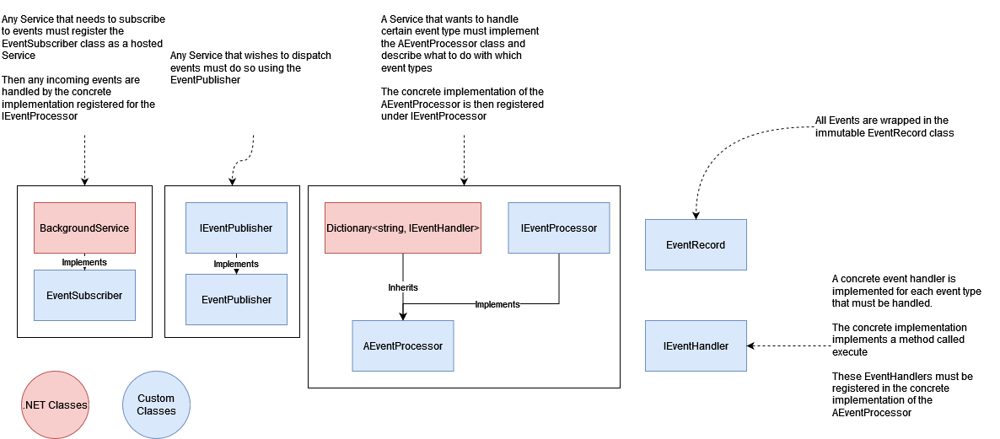
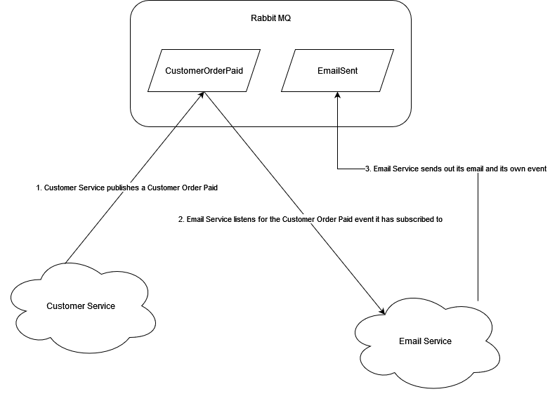

# Event Bus 

A Event Bus allows multiple services to communicate asynchronously without directly coupling the services. I.E. service A does not need to know where or how service B works in order to communicate with it.

In an event based system there exist publishers and subscribers

##### Publisher
A Publisher dispatches events that can be consumed by others

##### Subscriber
A Subscriber listens for an event to fire and then does something the events information

A Service is often both publisher and subscriber

## Required Components
These classes are used in order to implement this architecture



## What an event might look like



# Code Specific Instructions

## Registering Event Handlers for Events
Here we are registering the CreateAirshipEventHandler class with the "CREATE_AIRSHIP" event

Now when the CREATE_AIRSHIP event is received, the CreateAirshipEventHandlers Execute method will be invoked

This EventProcessor must be registered correctly in DI for it to be used
```cs
public class AirshipEventProcessor : AEventProcessor {

    public AirshipEventProcessor(IServiceScopeFactory scopeFactory) : base(scopeFactory){
        this["CREATE_AIRSHIP"] = new CreateAirshipEventHandler(scopeFactory);
        
        
    }
    
}
```

## Dispatching an Event
We inject the IEventPublisher via the constructor and dispatch a string which contains the json representation of the underlying event we want to dispatch

```cs
class TestController : Controllerbase {

    private IEventPublisher _eventPublisher;

    public TestController(IEventPublisher eventPublisher) {
        this._eventPublisher = eventPublisher;
    }

    public async Task<IActionResult<string>> Get() {
        this._eventPublisher.Publish(JsonSerializer.Serialize(new InformationRequestedEvent()));
    }
}
```


## Dependency Injection Setup

Event Publishers and Processors must be registered as singletons

```cs
builder.Services.AddSingleton<IEventPublisher, EventPublisher>(); // Needed if the service intends on dispatching events
builder.Services.AddSingleton<IEventProcessor, AirshipEventProcessor>(); // Depends on your concrete implementation

builder.Services.AddHostedService<EventSubscriber>(); // Must be added in order for events to be handled at all
```