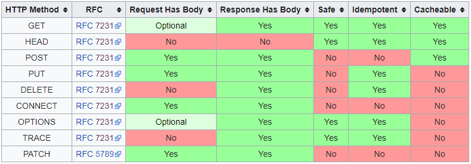

# HTTP - Hyper Text Transfer Protocol
- GET - For oneway transfer of information / Stateless, always returns the same
- PUT - For adding information to server
- POST - For modifying multiple rows of information
- PATCH - For modifiying one row of information
- DELETE - For deleting information
- HEAD - Like Get but without returning body
- OPTIONS - Return information regarding what Methods return
- TRACE - Debugging Method
- CONNECT - For connecting to a URI

