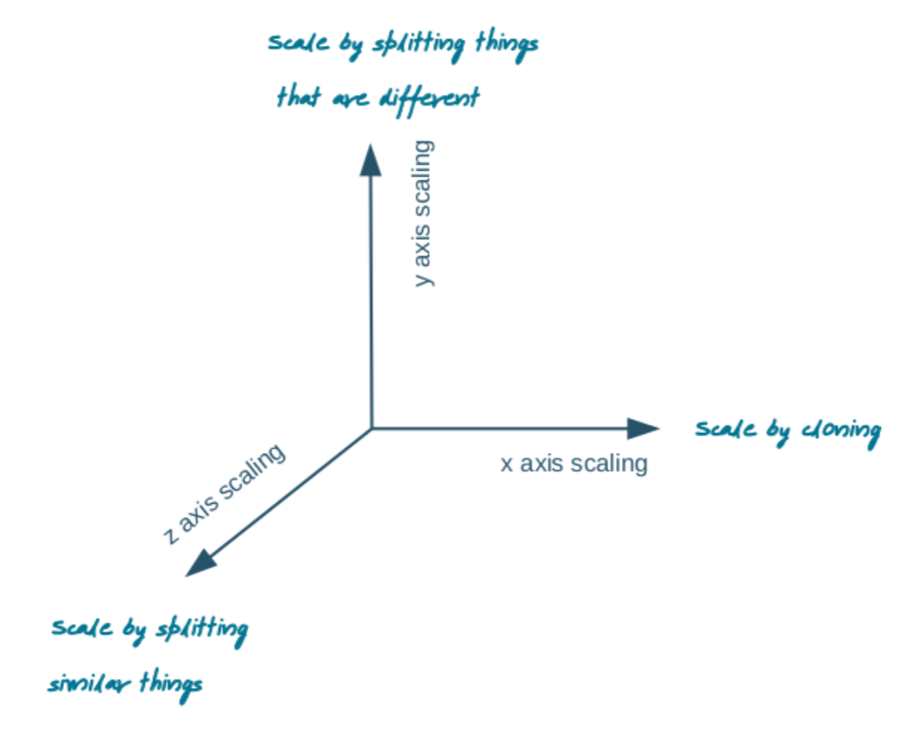
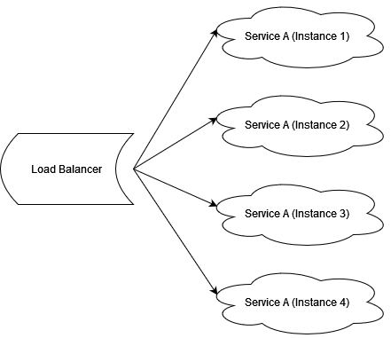

# Properties of decentralized systems

## Big Data
A decentralized system must be highly scalable to be used in big data

The technical requirements in Big Data are often referred to as 3V - Volume, Velocity, Variety

### Volume
Is the amount of data passing through the system

### Velocity
Describes the speed at which data must pass through the system

### Variety
How structurally different data is in the system

## Scalablity vs Performance
Often misconstrued with one another

### Performance
Is the speed at which the application is able to handle requests

### Scalablity
Describes how well a system is able to handle progressive load

### Availablity
Is the ability of a system to handle a client request within a certain time frame

# Dimensions of Scalability

## X Scaling - Horizontal Scaling - Duplication
Most common and simplest scaling method
Multiple instances of a service are started in parallel and a load balancer distributes all work amongst them
This also a type of hardware scaling

## Z Scaling - Data Partitioning
Just as with Horizontal Scaling multiple instances are started of an application
However now each instance is responsible for certain part of data
Instead of load balancer, now a router is distributing load amongst the instances

## Y Scaling - Functional Decomposition
Whereas X Scaling and Z Scaling increases the systems availability and capacity, Y Scaling is related to the complexity of the system

Y Scaling is segmenting the application into services

# Openness
A Decentralized Application must be open for extensiblity in order to be maintainable

Good Maintainablity means that changes and features are easy and financially viable. Furthermore changes should not break existing systems

In order to design an open system its business logic must be split into components (to ensure low coupling)

## Interoperability
Is to which degree two components from seperate producers are able to work together

## Portability
Is how easily the application is able to run on other architectures without modification