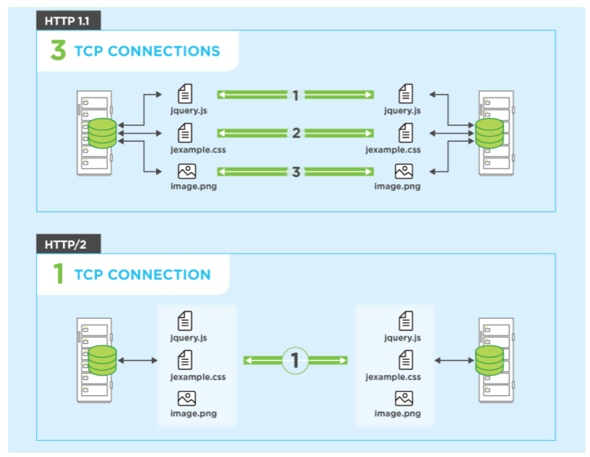
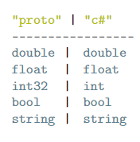
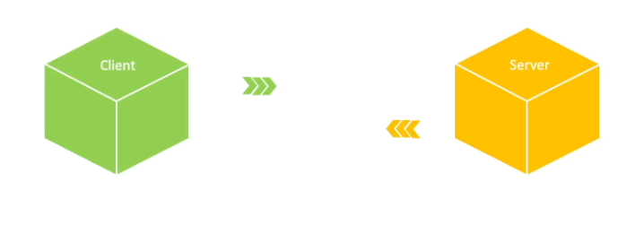
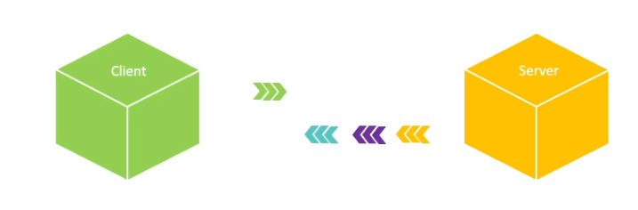
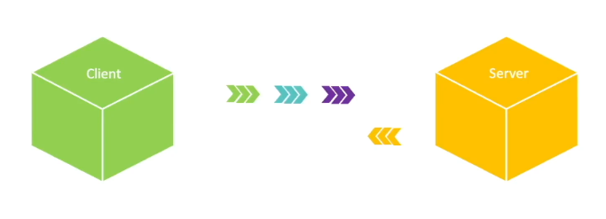
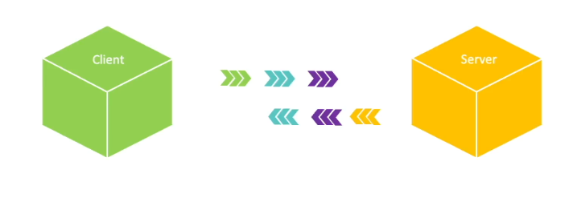

# GRPC
Google Remote Procedure Call is a high perfromance framework for creating APIs

It highly optimises the flow of information between two clients

The underlying transport protocol of GRPC is HTTP/2


The API is described by using a Interface Definition Language called Protobuf

Example:

```protobuf
syntax = "proto3";

package hello;

// Interface Definition
service Greeter {
    rpc Greet(HelloRequest) returns (HelloReply) {}
}

// Definition of Data types
message HelloRequest { string name = 1; }
message HelloReply { string message = 1; }
```

## Greet Example

```protobuf
// Version
import "google/protobuf/empty.proto";
syntax = "proto3";
// Interface with multiple methods
service Greeter {
    rpc Greet(HelloRequest) returns (HelloReply) {}
    rpc CreateReply(google.protobuf.Empty) returns (EntityReply) {}
}
```

# Syntax

## Datatype Definitions

```protobuf
message <name> {
    <field rule> <type> <field name> = <index of parameter>,
    ...
}
```

Example:
```protobuf
message HelloRequest {
    string name = 1;
}
```

### Data Types


### Field Rules
Are attributes to describe message fields
- repeated: list of field

### Setting Defaults
!!! Warning removed in proto3, works in proto2

Example:
```protobuf
message TestRequest {
    int32 id = 1 [default = 0 ];
}
```

## Enums

```protobuf
// Syntax Datatypes
message ProjectRequest {
string title = 1;
string description = 2;
EProjectType type = 3
    [ default = REQUEST_FUNDING_PROJECT ];
}

enum EProjectType {
    REQUEST_FUNDING_PROJECT = 0;
    RESEARCH_FUNDING_PROJECT = 1;
    MANAGEMENT_PROJECT = 2;
}
```


# Code Example Greeter

## Service Implementation
```cs
public class GreeterService : GreeterBase {
    public override Task<HelloReply> Greet(HelloRequest r, ServerCallContext context) {
        return Task.FromResult(
            new HelloReply{message = $"hello {r.name}!"};
        );
    }
}
```

## Client Call
```cs
public class Program {
    var channel = GrpcChannel.ForAddress(
        "http://localhaost:5242"
    );
    var client = new GreeterServiceClient(channel);
    var reply = client.Greet(
        new HelloRequest{ Name="Freddy" }
    );
    Console.Writeln(reply.Message);
}
```

# GRPC vs REST
## REST
Connection Count: TCP Connection per request
Messageformat: Plaintext Headers
Communication: Unary, One Way
Messagedelivery: Client -> Server
API Methods: get/put/post/delete

## GRPC
Connection Count: Single Connection per client
Messageformat: Binary
Messagedelivery: Streaming - Multiplexing
Api Methods: Free Design


# Communication Types

## Unary Communication
Service answers with a single response to a client request


### Protofile

```protobuf
service Greet {
    rpc GreetAsync(Request) returns (Response) {}
}
message Request { ... }
message Response { ... }
```

### Service Implementation

```cs
public class GreeterService : GreeterBase {
    public override Task<Response> GreetAsync(Request r, ServerCallContext context) {
        return Task.FromResult(
            new HelloReply{message = $"hello {r.name}!"};
        );
    }
}
```

### Client Invokation
```cs
public class Program {
    var channel = GrpcChannel.ForAddress(
        "http://localhaost:5242"
    );
    var client = new GreeterServiceClient(channel);
    var reply = client.Greet(
        new Request{ Name="Freddy" }
    );
    Console.Writeline(reply.Message);
}
```

## Serverside Streaming

A Service responds to clients request with a continous stream of data

Also often used to avoid polling




### Protofile

```protobuf
service DataService {
    rpc UpdateData(Request) returns (stream Response) {}
}
message Request { ... }
message Response { ... }
```

### Service Implementation

```cs
public class DataService : DataServiceBase {
    public override async Task UpdateData(Request r, IServerStreamWriter<Response> responseStream, ServerCallContext context) {
        foreach(int i in Enumerable.Range(1,10)){
            await responseStream.WriteAsync(
                new Response{message = $"{i}"}
            );
        }
    }
}
```

### Client Invokation
```cs
public class Program {
    var channel = GrpcChannel.ForAddress(
        "http://localhaost:5242"
    );
    var client = new DataServiceClient(channel);
    var reply = client.UpdateData(
        new Request{ Name="Freddy" }
    );
    await foreach (var data in reply.ResponseStream.ReadAllAsync()){
        Console.WriteLine($"calculated number: {data}");
    }
}
```

## Clientside Streaming
A client sends a stream of data to the server and the server responds with a single message



### Protofile

```protobuf
service DataService {
    rpc UploadAsync(stream Request) returns (Response) {}
}
message Request { ... }
message Response { ... }
```

### Service Implementation

```cs
public class DataService : DataServiceBase {
    public override async Task<Response> UploadAsync(IAsyncStreamReader<Request> requestStream, ServerCallContext context) {
        var data = new List<Project>();
        await foreach(var request in requestStream.ReadAllAsync()){
            data.Add(new Project{ Id = request.Project.Id});
        }
        return new Response{message="Calculated data"};
    }
}
```

### Client Invokation
```cs
public class Program {
    var channel = GrpcChannel.ForAddress(
        "http://localhaost:5242"
    );
    var client = new AuctionServiceClient(channel);
    using var duplexStream = client.Bet();
    var receiverTask = Task.Run(
        async () => {
        ... // 3.) Receiving Content from Service
        }
    );
}
```

## Bidirecitonal Streaming

Both Client and Server send eachother a continous stream of data



### Protofile

```protobuf
service AuctionService {
    rpc Bet(stream Request) returns (stream Response) {}
}
message Request { ... }
message Response { ... }    
```

### Service Implementation

```cs
public class AuctionService : AuctionServiceBase {
    public override async Task Bet(IAsyncStreamReader<Request> requestStream,IServerStreamWriter<Response> responseStream,ServerCallContext context) {
        await foreach(var request in requestStream.ReadAllAsync()) {
            var index = request.Index;
            
            foreach(int i in Enumerable.Range(1,index)) {
                await responseStream.WriteAsync(new Response{message = $"{i}"});
            }
        }
    }
}
```

### Client Invokation
```cs
public class Program {
    var channel = GrpcChannel.ForAddress("http://localhaost:5242");
    var client = new AuctionServiceClient(channel);
    using var duplexStream = client.Bet();

    var receiverTask = Task.Run(
        async () => {
        ... // 3.) Receiving Content from Service
        }
    );
    // 2.) Sending Data ...
    var receiverTask = Task.Run(
        async () => {
        ... // 3.) Content
        }
    );
    // 2.) Sending Data to Service
    await duplexStream.RequestStream.WriteAsync(
        new Request{Index = 5};
    );
    await duplexStream.RequestStream.WriteAsync(...);
    await receiverTask;

    // Receiving Data from Service
    var receiverTask = Task.Run(
        async () => {
            await foreach(var response in
                duplexStream.ResponseStream.ReadAllAsync()) {
                    Console.WriteLine($"index: {response.Message}")
            }
        }
    );
}
```